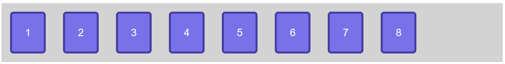
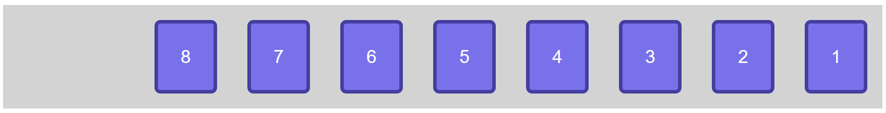
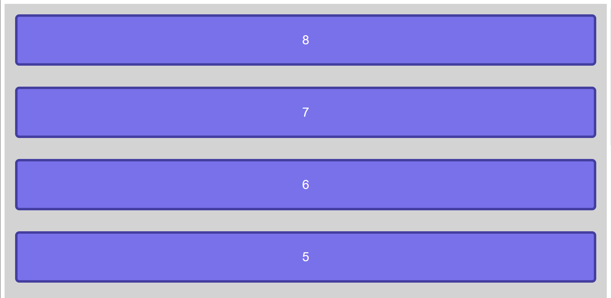
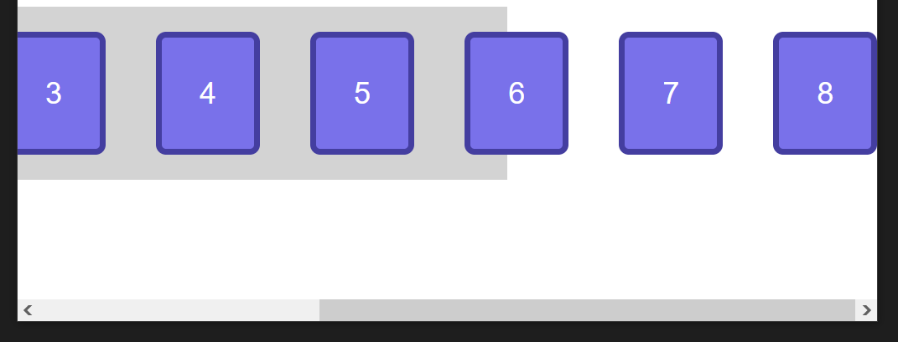
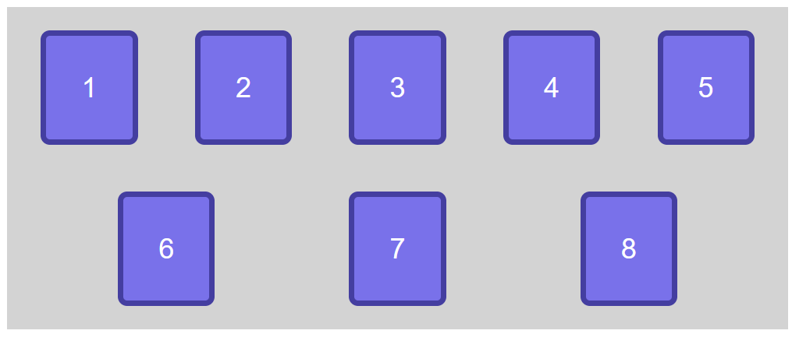

# Exemple de flexbox

## Step0

Question : Quel est le display de départ de la div .container ?

## Step1

Question : Quelles sont les modifications apportées dans le code ?

## Step2

Question : Quelles sont les modifications apportées dans le code ?

## Step3

Question : Quelles sont les modifications apportées dans le code ?

## Step4

Question : Quelles sont les modifications apportées dans le code ?

## Step5

Voila la situation de départ :

J'ai réduit volontairement la fenetre de mon navigateur et j'obtiens cela :

Comme les éléments dans le conteneur n'ont pas assez de place pour s'afficher, un ascenceur horizontal apparaît.

Question : Comment faire pour que les éléments 6, 7, 8 s'affichent sur la ligne en dessous ?

## Step6

Question : Quelles sont les modifications apportées dans le code ?

