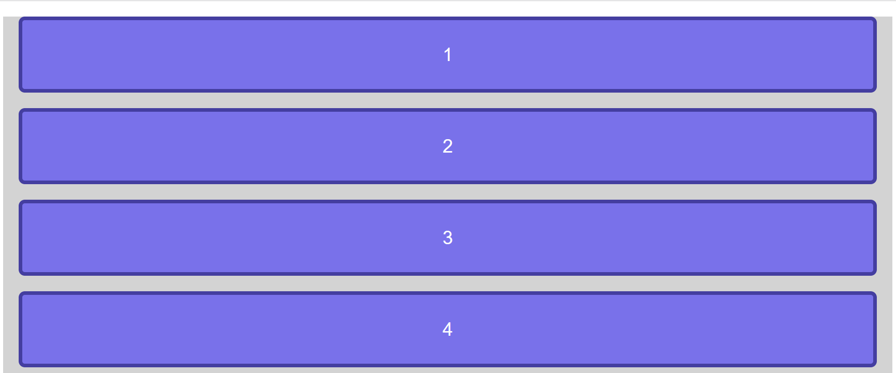
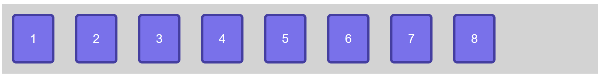
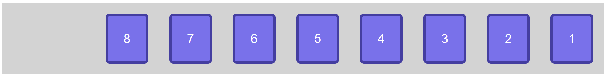
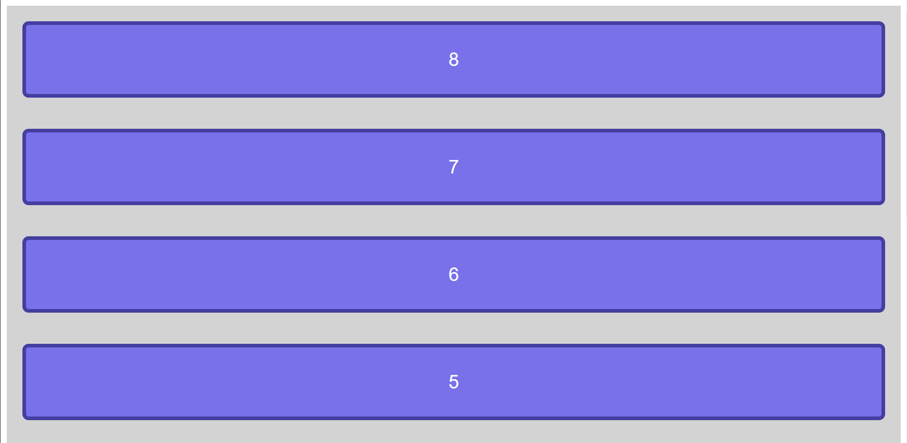
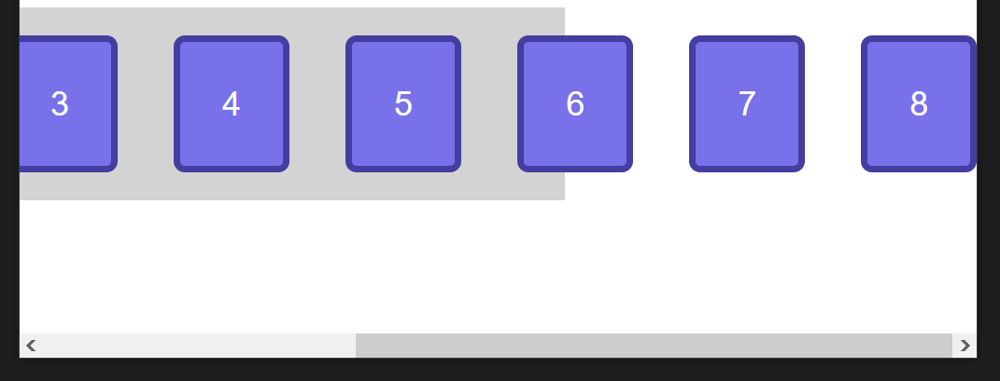
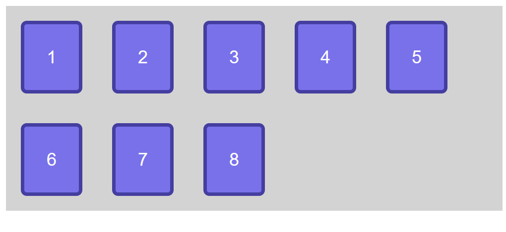
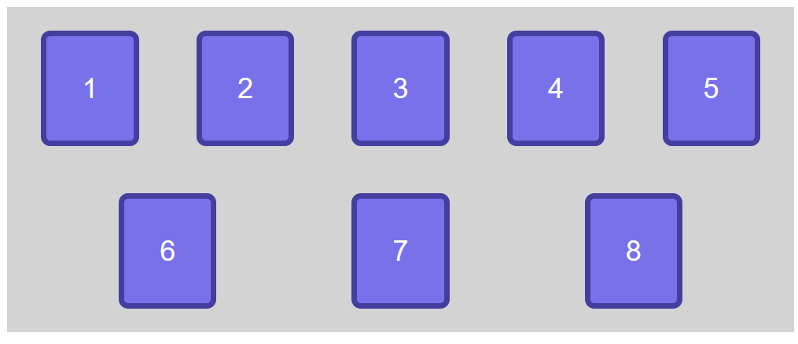

# Exemple de flexbox

## Step0

Question : Quel est le display de départ de la div .container ?



Solution :

```css
display: block;
```

On peut vérifier cela avec l'inspecteur de notre navigateur.
En `display block` les `div` prennent 100% de la largeur.

## Step1

Question : Quelles sont les modifications apportées dans le code ?



Solution :

```css
.container {
  display: flex;
}
```

- Les éléments (à l'intérieur du container) ne prennent plus 100% de la largeur
- Les éléments sont affichés les uns à côtés des autres car par défaut l'axe principal est défini horizontalement.
- Les éléments vont commencer à gauche et vont se distribuer dans l'espace restant

```css
.container {
  display: flex;
  flex-direction: row; /* Comme row est la valeur par défaut cela ne change rien */
}
```

## Step2

Question : Quelles sont les modifications apportées dans le code ?



Solution :

Sur l'axe principale, le sens de distribution des éléments a changé

```css
.container {
  display: flex;
  flex-direction: row-reverse;
}
```

## Step3

Question : Quelles sont les modifications apportées dans le code ?



Solution :

```css
.container {
  display: flex;
  flex-direction: column-reverse;
}
```

## Step4

Question : Quelles sont les modifications apportées dans le code ?


Solution :

```css
.container {
  display: flex;
  flex-direction: column;
}
```

On aurait pu répondre que l'on a modifié ainsi

```css
.container {
  display: block;
}
```

## Step5

Voila la situation de départ :

J'ai réduit volontairement la fenetre de mon navigateur et j'obtiens cela :



Comme les éléments dans le conteneur n'ont pas assez de place pour s'afficher, un ascenceur horizontal apparaît.

Question : Comment faire pour que les éléments 6, 7, 8 s'affichent sur la ligne en dessous ?

Solution :

```css
.container {
  display: flex;
  flex-direction: row;
  flex-wrap: wrap;
}
```



## Step6

Question : Quelles sont les modifications apportées dans le code ?



Solution :

```css
.container {
  display: flex;
  flex-direction: row;
  flex-wrap: wrap;
  justify-content: space-evenly;
}
```

`justify-content` est une propiété qui permet de gérer l'alignement sur l'axe principal

`space-evenly` permet de répartir l'espace entre les éléments
